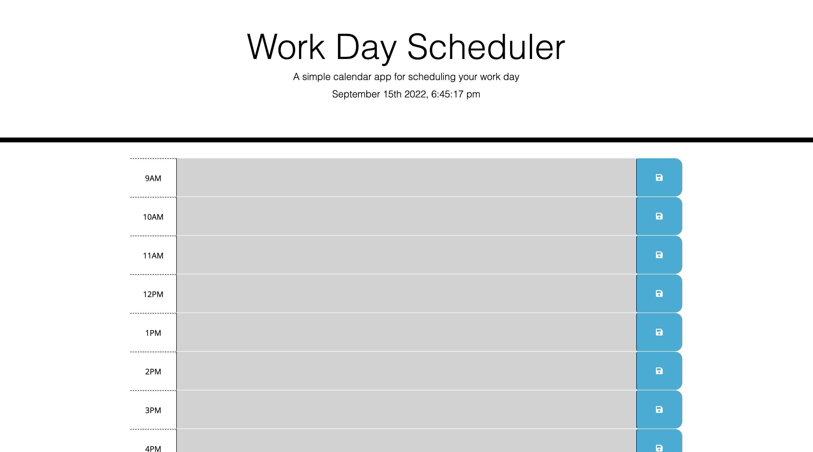

# Hourly-Planner

## Description

- What was your motivation?
  I wanted to implement Bootstrap and jquery to generate a basic daily calendar where I could timeblock by the hour. This calendar would tell me the day that I was on and change color once the hour has passed. 
- Why did you build this project? 
  I built this project to incorporate cnds into my work and expand my knowledge and troubleshooting my javascript. I was able to build on the css file that was already given and make elements in the html file that would match the class and id in the css, then later call them in my javascript to manipulate them. 
- What problem does it solve?
  It solved the problem of maintaining text in my schedule even after reloading which i found to be the most challenging aspect of the project. I also went through a significnat amount of degbugging in order to get my if statement to work. 
- What did you learn?
  I used console.log alot more on this project to troubleshoot and debug my code. I feel like I was able to make more progress and understand the for loop as well as the different query elements alot better with this project than I have with my previous projects by torubleshooting my code constantly with console.log. 

## Installation

To use, click on the link below and write in text area what you want to plan out for your day, the color of the boxes will change as the hour changes as shown in the screenshot. In order to save a task in the calendar, add text and the text and click the blue button adjacent to the textarea and the text will remain there until a new task is added. The day of the week as well as day of the month will automatically update. 

https://sankyrajeev.github.io/work-day-scheduler/

## Usage

md

 

